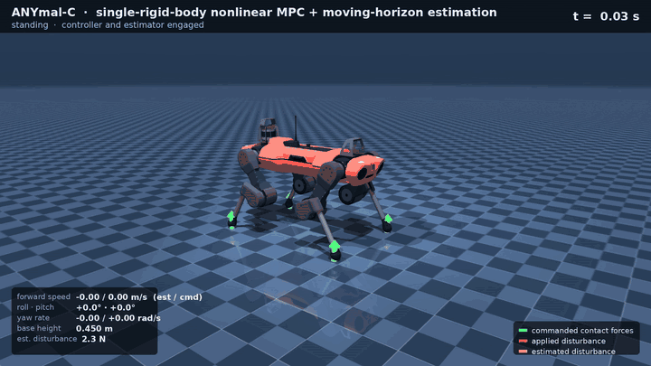

# Unified SRBD NMPC + moving-horizon estimation for ANYmal-C

Output-feedback trotting control of a 45 kg quadruped in MuJoCo, where a
nonlinear model predictive controller and a nonlinear moving-horizon estimator
**share one single-rigid-body model, one symbolic source and one design
language**. The estimator reconstructs the base state and an external
disturbance wrench from proprioception only (IMU + leg kinematics + joint
torques); the controller plans ground reaction forces inside friction cones over
half a second of gait, at 100 Hz, and feeds the estimated disturbance forward.

<p align="center">
  
</p>

**Full-resolution animation:** [`media/anymal_walk_hd.mp4`](media/anymal_walk_hd.mp4) (1080p50, H.264) ·
[`media/anymal_walk_hd.webm`](media/anymal_walk_hd.webm) (VP9) ·
**Full write-up:** [`docs/report.pdf`](docs/report.pdf) (complete derivations and results)

---

## What it does

The scenario in the animation, run end to end with sensor noise and no
ground-truth feedback anywhere in the loop:

| phase | what happens |
| --- | --- |
| 0–1 s | stands; controller and estimator converge and engage |
| 1–3.5 s | forward command ramps to 0.4 m/s, trot at 0.7 s gait period |
| 3.5–4.3 s | 40 N lateral push on the trunk — estimated at 39.5 N and fed forward |
| 5–8 s | 0.3 rad/s turning command while trotting |

Measured (seed 0, rms over the walking phase):

| quantity | result |
| --- | --- |
| attitude estimation error | 1.4 / 2.6 / 1.7 mrad (roll / pitch / yaw) |
| velocity estimation error | 9 / 10 / 7 mm/s |
| base height | 0.452 ± 0.002 m (0.45 m commanded) |
| roll, pitch excursion | ≤ 0.089, ≤ 0.063 rad over the whole run |
| lateral drift caused by the push | 0.15 m with force feed-forward vs 0.74 m without |
| NMPC cycle (N = 50, 100 Hz) | 0.56 ms preparation, 56 µs feedback, 0.11 µs input latency |
| NMHE cycle (M = 20, 100 Hz) | 0.24 ms preparation, 1.1 µs instantaneous estimate, 37 µs feedback |
| robustness | 5/5 noise seeds complete; stable up to 2× nominal sensor noise |

Everything above is reproduced by the scripts in `sim/`; every number in the
report comes from the logged data in `results/data/`.

## How it is put together

```
              ┌──────────────── planner (100 Hz) ─────────────────┐
              │ gait schedule · Raibert footholds · swing curves  │
              │ references · stage parameters · foot anchoring    │
              └───▲────────────────────────────────────┬──────────┘
        x̂, d̂     │                                    │ xʳ, fʳ, π₀…π_N
   ┌──────────────┴───────┐                    ┌───────▼──────────┐
   │  RTI NMHE  (M = 20)  │                    │ RTI NMPC (N = 50)│
   │  18 states: 12 rigid │                    │  12 states       │
   │  body + 6 wrench     │                    │  12 inputs (GRF) │
   │  21 outputs, 28 rows │                    │  28 constraint   │
   └──────────▲───────────┘                    │  rows per stage  │
   IMU, q, q̇, │ τ → measured GRF               └───────┬──────────┘
              │                                        │ f₀
   ┌──────────┴────────────────────────────────────────▼──────────┐
   │  leg controller 500 Hz:  τ = −Jᵀf + b (stance) │ PD (swing)  │
   │  MuJoCo ANYmal-C, 18 DoF, 2 ms step                          │
   └──────────────────────────────────────────────────────────────┘
```

The model is generated once, symbolically, and instantiated twice:

* **Controller** — single-rigid-body dynamics with gait-scheduled contacts;
  per-stage parameters (predicted foot positions, contact flags, disturbance
  feed-forward) are supplied out of band so that the input dimension and the
  constraint set stay fixed across contact switches. Friction pyramids, normal
  force bounds and attitude bounds are enforced inside the solve.
* **Estimator** — the same dynamics with the state augmented by a random-walk
  disturbance wrench. Contact flags, foot anchors and measurement gates travel
  in the estimator's *known input*, so a measurement set that changes at every
  touchdown never changes the problem dimension. Outputs are attitude, gyro,
  kinematic COM velocity and COM-relative foot positions, each gated by settled
  stance.

Modelling decisions that turned out to be load-bearing (each was isolated by
comparing ground-truth-fed and estimator-fed closed loops; all are tabulated in
the report):

1. **Realised, not commanded, contact forces as the estimator's known input** —
   commanded forces make every touchdown impact look like a large disturbance.
2. **Disturbance as a random-walk state, not a penalised estimator input** — a
   disturbance acting over one 10 ms interval is almost unobservable from that
   interval's measurement, so the input version lags badly and cannot be fed
   forward.
3. **Settled-stance gating, contact detection, and contact-point Jacobians** —
   a foot still sliding into its footprint, or a Jacobian taken at the sphere
   centre of a rolling foot, biases leg odometry by centimetres per second.
4. **Bias-compensated stance torque mapping** — `τ = −Jᵀf` alone leaves ~12 N
   per foot of leg-gravity error, which the height loop absorbs as a 5–9 cm
   offset.
5. **Feed forward the estimated force, not the estimated torque** — the torque
   channel carries the swing legs' reaction at gait frequency; feeding it back
   doubles the roll excursion.

## Repository layout

```
model/anymal_srbd.py      symbolic SRBD model (SymPy) → generated C header:
                          dynamics, Jacobians, constraints, outputs, CSE
sim/robot.py              MuJoCo plant, emulated sensors, 500 Hz leg controller
sim/gait.py               gait schedule, footholds, swing trajectories, anchors
sim/framework.py          the closed loop (estimator → planner → controller)
sim/solvers.py            ctypes bindings + derivative/consistency checks
sim/run_walk.py           all experiments (main run, ablations, seeds, scaling)
sim/make_figs.py          the report figures
sim/render_hd.py          the 1080p animation
interface/solver_abi.h    the documented C interface the framework binds to
interface/README.md       what is withheld, and how to plug in another solver
results/data/             every logged trajectory (.npz) + summary JSONs
results/fig/              figures used in the report
docs/                     the report (report.pdf) and its LaTeX source (report_src/)
media/                    animation (mp4, webm, gif), poster, contact sheet
```

## The solver, and what is not in this repository

The NMPC and MHE solvers are my own: a constrained real-time-iteration NMPC
solver and its moving-horizon-estimation variant, developed as an extension of
my master's thesis on **SLQP-MPC** (sequential linear-quadratic programming MPC
for a Quanser linear inverted pendulum, Friedrich-Alexander-Universität
Erlangen-Nürnberg). That work is **ongoing and not yet published**, so the
solver algorithms, their source, and the wrapper translation units that embed
them are **not part of this repository** — only the interface they present is
documented, in [`interface/solver_abi.h`](interface/solver_abi.h).

This repository is therefore the *application*: the reduced-order model and its
generator, the gait and foothold planner, the proprioceptive measurement model,
the plant, the full closed loop, the experiments and the analysis. Solver
performance is reported (per-cycle wall times, memory footprint, horizon
scaling) because it characterises what the framework runs on; the mechanisms
behind those numbers are not described.

**Running it** therefore needs the two shared libraries behind that interface.
Two routes:

* ask me for the compiled libraries (happy to share a binary for evaluation), or
* implement the ABI on top of any RTI-capable package — `acados` covers every
  requirement, and no Python in this repository changes. See
  [`interface/README.md`](interface/README.md).

Without a solver you can still regenerate every figure and number from the
logged data:

```bash
python3 sim/make_figs.py        # figures from results/data/*.npz
```

and with the libraries in place:

```bash
python3 model/anymal_srbd.py                              # emit the C model
make -C c N=50 TS=0.01 M=20 TSE=0.01                      # build the two .so
python3 sim/solvers.py                                    # derivative checks
MUJOCO_GL=osmesa python3 sim/run_walk.py                  # all experiments (~3 min)
MUJOCO_GL=osmesa python3 sim/render_hd.py --fps 50        # 1080p animation
```

Requirements: Python 3.10+, `numpy`, `sympy`, `mujoco>=3`, `matplotlib`,
`imageio`, `imageio-ffmpeg`, `pillow`, plus `gcc` and the
[MuJoCo Menagerie](https://github.com/google-deepmind/mujoco_menagerie) ANYmal-C
assets (place a `mujoco_menagerie` checkout beside this repo, or edit `meshdir`
in `sim/anymal_c_torque.xml`, which is the
torque-actuated variant used here).

## Verification

* generated C model vs. its SymPy source: 1.7 × 10⁻¹³ max deviation;
* all Jacobians, including the RK4 sensitivity chain, vs. central differences:
  2.5–3.2 × 10⁻⁹ relative;
* controller and estimator dynamics agree bitwise for identical arguments (the
  operational meaning of "one model source");
* rigid-body residual against the plant with measured contact forces: zero-mean,
  with isolated touchdown spikes — this is what bounds what the disturbance
  state must absorb;
* solver solutions: six cycles from a cold start to a 10⁻¹⁰ KKT residual at
  frozen parameters, cold and warm starts agreeing on the active constraints.

## Author

**Sreeram Anil** — master's student, Friedrich-Alexander-Universität Erlangen-Nürnberg.
If this work is useful to you, please keep the attribution (Apache-2.0, §4) and, for
academic use, cite it as: *Sreeram Anil, "Unified SRBD NMPC/NMHE framework for
ANYmal-C," 2026.*

## Notes

* Licence: **Apache License 2.0** (see `LICENSE` and `NOTICE`). You are free to
  use, modify and redistribute this code, including commercially; in return the
  licence requires that my copyright and attribution notices are retained — every
  source file carries an `SPDX-License-Identifier: Apache-2.0` header naming
  Sreeram Anil, and the `NOTICE` file must travel with any redistribution. The
  ANYmal-C assets are the MuJoCo Menagerie's, BSD-3.
* Questions, or interest in the solver work: please get in touch.
